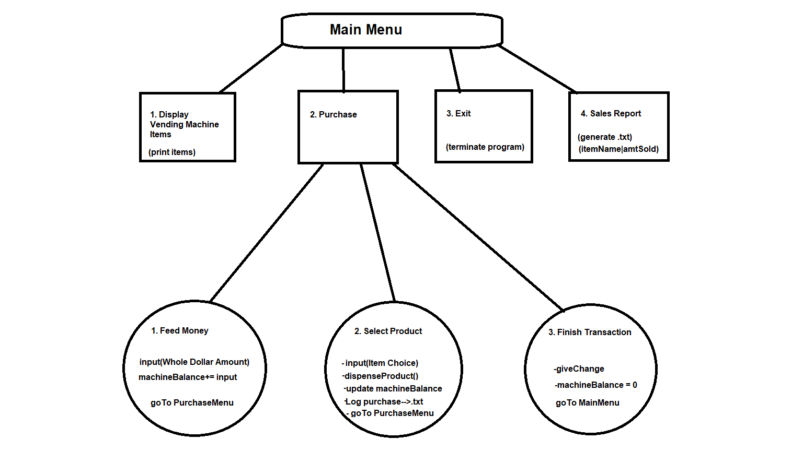

<H1>Purchase Menu</H1>
<u><h3>1. FEED MONEY</h3></u>                                                          

     
a. User can continuously add money (up to how much??)  
b. Whole Dollar Amounts Only (convert these to BigDecimal)

 
 

<u><h3>2. SELECT PRODUCT</h3></u>                                            

   
a. Display products (copy and paste this) 
          
b. insert logic within this nest
          
c. if (money < price) {ask for more money}  
          
d. Dispense Product: 
        
>All chip items print "Crunch Crunch, Yum!" 
        All candy items print "Munch Munch, Yum!" 
        All drink items print "Glug Glug, Yum!" 
        All gum items print "Chew Chew, Yum!"  
          
e. Write purchase to log.txt (01/01/2016 12:00:00 PM FEED MONEY: $5.00 $5.00) 
                             
f. Return customer to Purchase Menu

g. Update Machine Balance::: if (money > price) {machineBalance+= (custMoney - price)}
 
 
 

<u><h3>3. FINISH TRANSACTION</h3></u>                                             

       
a. giveChange --> print("Here's your change:" + " " + machineBalance)

b. machineBalance-= machineBalance

c. Return customer to Main Menu  

d. write transactions to log file

<h1>Main Menu</h1>

<u><h3>3. Exit</h3></u>
a. Terminate program

<u><h3>4. SALES REPORT</h3></u>                                                       

a. Total sales for each item
 -per machine instance (program instance)
      
b. Write each <u><b>item | totalSold</b></u> to txt.file 
            Potato Crisps|10 
            Stackers|3 
            Grain Waves|0
    

*************************************************************************************************************
                                        TO DO LIST                                                          *
*************************************************************************************************************

--Dispenses item
    //add message

--Main Menu: 1. Display, 2. Purchase, 3. Exit
    //add "3. Exit" option

--Automatically restocked
    //Test this

--(1.) Displays all items and info
    //Add "Sold Out" if inventory == 0

--Add Purchase Menu (Nested--> (2) Purchase)

******************************************************************************************************************
                                        COMPLETED TASKS                                                          *
******************************************************************************************************************
Vending machine stocked via CVS file

